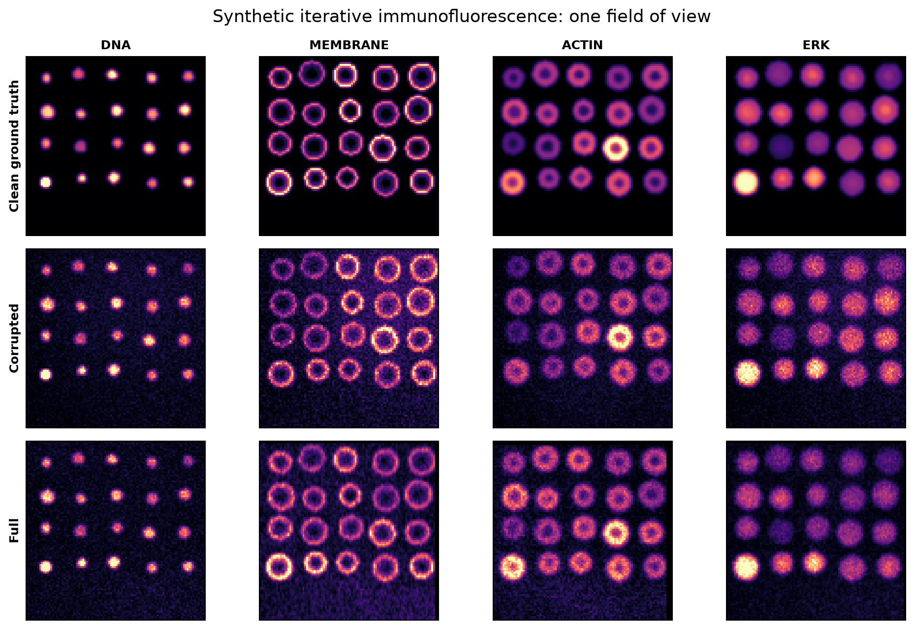
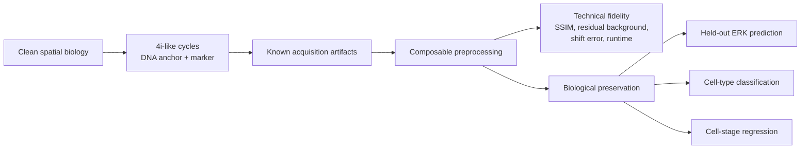
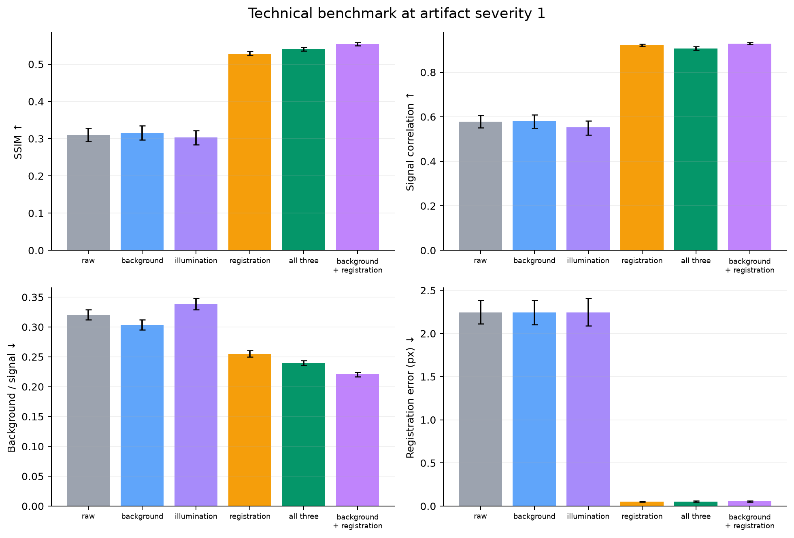
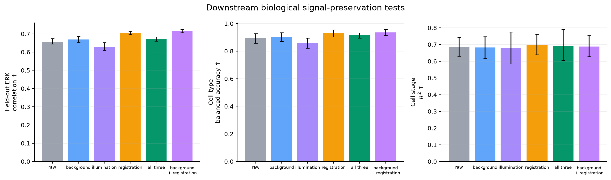
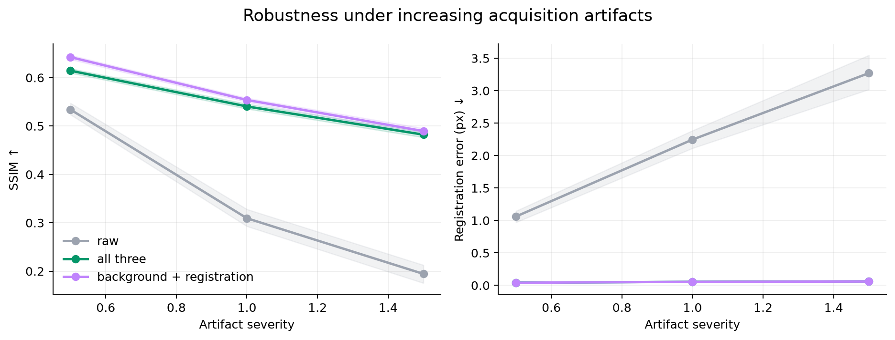

# MuxPreBench

**A reproducible research prototype for asking one focused question: which
preprocessing choices preserve useful biological information in multiplexed
fluorescence microscopy?**

This repository is an independent portfolio demo inspired by TUM Data
Innovation Lab's project
[Benchmarking Preprocessing Strategies for Multiplexed Imaging Data](https://www.mdsi.tum.de/di-lab/projekte/ws26-tum-mathematical-modelling-of-biological-systems-benchmarking-preprocessing-strategies-for-multiplexed-imaging-data/).
It is not an official project deliverable and uses synthetic data, not data from
the Battich Lab.



## Why this demo

The three DI-LAB descriptions share a common experimental core:

- reproducible preprocessing for high-dimensional biomedical data;
- strong, matched baselines and ablation studies;
- robustness testing under acquisition or modality degradation;
- quantitative metrics connected to downstream-task performance;
- modular Python scientific-ML workflows and clear visual reporting.

Project 1 adds requirements that should define the repository, rather than be
mixed with unrelated time-series problems: iterative 4i-like acquisitions,
background subtraction, illumination correction, cycle registration,
resolution enhancement, per-step technical metrics, and downstream tests of
protein localization, cell type, and cell-cycle state.

MuxPreBench therefore implements a narrow microscopy benchmark around the first
three preprocessing axes. Resolution enhancement is intentionally left for a
real follow-up: generic sharpening would not be a credible substitute for a
compressed-sensing method with an appropriate point-spread model and
high-resolution reference.

## Experimental design

Each synthetic field contains 20 cells, four spatial marker patterns, a binary
cell type, and a continuous cell-stage target. Every acquisition cycle contains
a repeated DNA anchor and one marker. The generator applies known cycle shifts,
vignetting and illumination gradients, autofluorescence-like background,
bleaching, Poisson shot noise, and Gaussian read noise. Clean biology is held
fixed across three artifact severities, enabling paired robustness tests.



The benchmark compares raw input, single-component baselines, all three
corrections, and leave-one-component-out ablations:

- **Background:** grayscale morphological opening;
- **Illumination:** retrospective Gaussian flat-field estimation;
- **Registration:** upsampled Fourier phase correlation on the repeated DNA
  anchor, with the estimated correction applied to its paired marker.

Downstream splits are made by complete field of view—not by cell or pixel—and
the exact same splits are reused across preprocessing methods. Aggregate image
metrics use field-level bootstrap intervals; candidate-versus-raw effects use
paired bootstrap intervals. See
[the full experiment specification](docs/EXPERIMENT_DESIGN.md).

## Results

The strongest configuration on this synthetic testbed is **morphological
background subtraction + phase registration**. At the reference artifact
severity, it outperforms raw images on both technical fidelity and two of three
downstream endpoints.

| Endpoint | Raw | Background + registration | Paired improvement (95% CI) |
|---|---:|---:|---:|
| SSIM ↑ | 0.309 | **0.554** | +0.244 [0.228, 0.262] |
| Foreground Pearson ↑ | 0.579 | **0.929** | +0.350 [0.325, 0.376] |
| Background / signal ↓ | 0.320 | **0.221** | 0.099 lower [0.091, 0.107] |
| Registration error (px) ↓ | 2.247 | **0.054** | 2.192 lower [2.043, 2.334] |
| Held-out ERK Pearson ↑ | 0.657 | **0.714** | +0.057 [0.049, 0.064] |
| Cell-type balanced accuracy ↑ | 0.893 | **0.935** | +0.042 [0.029, 0.056] |
| Cell-stage R² ↑ | 0.687 | 0.688 | +0.001 [-0.029, 0.027] |

Technical effects are paired over 24 fields; downstream effects are paired over
five group-level train/test splits. Values are generated from seed 23 using
[`configs/benchmark.yaml`](configs/benchmark.yaml), not manually entered toy
scores.





### What the ablation says

Registration is the dominant component: it reduces mean residual shift by more
than two pixels and substantially improves spatial marker relationships. The
naive single-image Gaussian flat-field correction slightly degrades sparse
marker structure, so enabling every step is not automatically optimal. This is
the central point of a benchmark: preprocessing assumptions must be tested by
signal type and downstream use, not accepted because a method is conventional.

Cell-stage R² does not improve reliably. The stage model is already robust to
the tested artifacts, and its paired interval crosses zero. This null result is
kept rather than hidden.



## Reproduce it

Python 3.10+ is supported through the ranged dependencies in `pyproject.toml`;
no GPU or external dataset is required.

```bash
python -m venv .venv
source .venv/bin/activate
python -m pip install -e ".[dev]"

# Fast six-field end-to-end check
make smoke

# Full 24-field × 3-severity benchmark
make benchmark
```

The full run generally takes about one minute after dependency import on a
modern laptop. The exact lock below reproduces the committed environment and
requires Python 3.12:

```bash
python -m pip install -r requirements-lock.txt
python -m pip install -e . --no-deps
```

Generated artifacts are deliberately committed so a reviewer can inspect the
claims without rerunning the experiment:

| Artifact | Purpose |
|---|---|
| [`technical_metrics.csv`](results/technical_metrics.csv) | Per-field, per-severity raw measurements |
| [`technical_summary.csv`](results/technical_summary.csv) | Bootstrap means and 95% intervals |
| [`downstream_metrics.csv`](results/downstream_metrics.csv) | Matched group-split downstream scores |
| [`paired_improvements.csv`](results/paired_improvements.csv) | Paired candidate-versus-raw effects |
| [`example_field.npz`](results/example_field.npz) | Machine-readable clean/raw/processed example |
| [`run_metadata.json`](results/run_metadata.json) | Seed, config hash, platform, and package versions |

## Repository layout

```text
configs/benchmark.yaml             # One declarative experiment definition
src/multiplexbench/
├── data.py                         # Paired synthetic 4i-like generator
├── preprocessing.py                # Composable correction methods
├── metrics.py                      # Technical endpoints + bootstrap CIs
├── evaluation.py                   # Leakage-safe sklearn downstream tasks
├── visualization.py                # Report figures from result tables
└── benchmark.py                    # End-to-end CLI orchestration
tests/                              # Data, methods, metrics, and downstream tests
results/                            # Committed experiment outputs
docs/EXPERIMENT_DESIGN.md           # Assumptions, endpoints, and limitations
```

`ruff`, `pytest`, and a six-field end-to-end benchmark run in GitHub Actions.

## Transferable evidence for the secondary DI-LAB projects

The repository stays centered on imaging, but several design choices transfer
naturally:

- For
  [Multimodal Emotion Learning with Foundation Models](https://www.mdsi.tum.de/di-lab/projekte/ws26-dsm-firmenich-multimodal-emotion-learning-with-foundation-models/):
  matched per-channel ablations, held-out-channel reconstruction, robustness to
  degraded inputs, group-safe evaluation, and reproducible scikit-learn model
  comparison are directly relevant to multimodal physiological signals.
- For
  [Unified Anomaly Detection in Multi-Disease Monitoring Using Auditable AI](https://www.mdsi.tum.de/en/di-lab/projekte/ws26-tum-bioinformatics-unified-anomaly-detection-in-multi-disease-monitoring-using-auditable-ai/):
  a single auditable pipeline applied across severity cohorts, explicit
  intermediate diagnostics, robustness curves, and traceable result artifacts
  demonstrate the same experimental discipline required for transparent
  cross-cohort monitoring.

The demo does not claim physiological signal processing, foundation-model, NCP,
emotion-recognition, or disease-detection experience. Its value for Projects 2
and 3 is evidence of transferable experimental practice, not superficial domain
coverage.

## Authors

- **Xuantong Ji** — TUM student ID 03821940
- **Lu Yu** — TUM student ID 03810035
- **Jiyao Zhang** — TUM student ID 03810015
- **Jiahang Song** — TUM student ID 03815779

All four authors contributed to the research prototype. GitHub co-author
attribution is recorded in the repository's initial commit.

## Limitations and realistic next steps

- Synthetic ground truth enables causal measurement but cannot establish a best
  practice for real 4i data.
- The illumination baseline estimates a field from one sparse image; a real
  study should compare retrospective multi-image estimators and acquired flat
  fields.
- Cell masks are held fixed to isolate preprocessing effects. A broader study
  should quantify interaction with segmentation.
- Generalization across species or tissue architecture is not tested here.

The first real-data extension would add an OME-TIFF/OME-Zarr adapter, store
cell-level features in AnnData, preserve the same pipeline and split contracts,
and validate recommendations on a second acquisition context. Credible
resolution enhancement would be added only with an appropriate optical forward
model and reference data.

## References

The scope follows the three official TUM DI-LAB project descriptions linked
above. Methodological inspiration includes MCMICRO, classical subpixel phase
registration, and the 4i protein-map literature cited in the primary project
description. This repository is released under the [MIT License](LICENSE).
